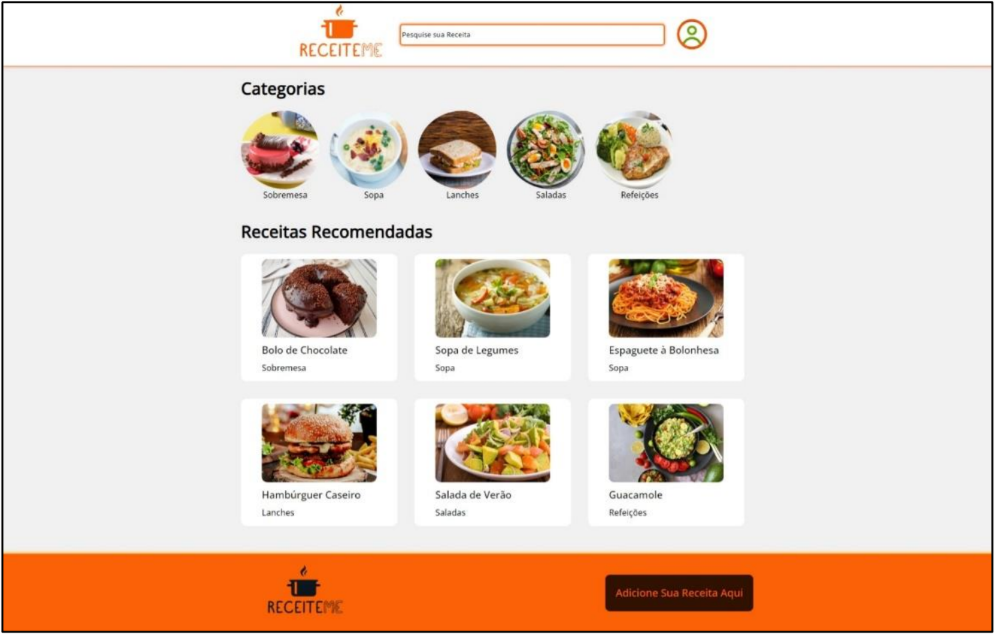
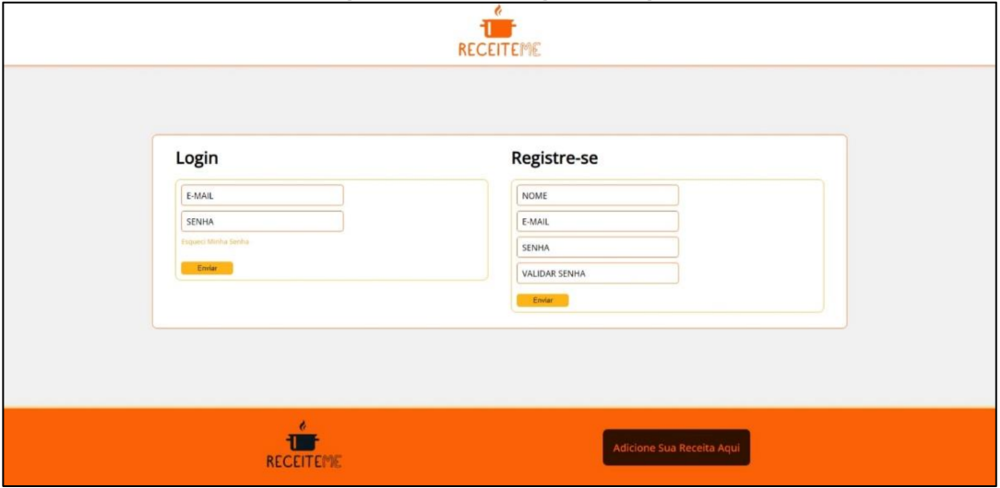
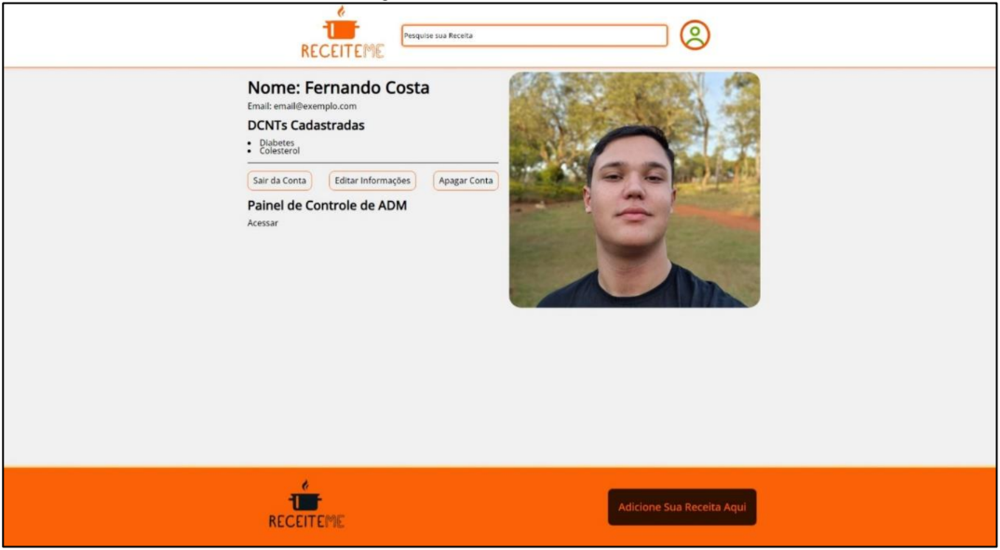
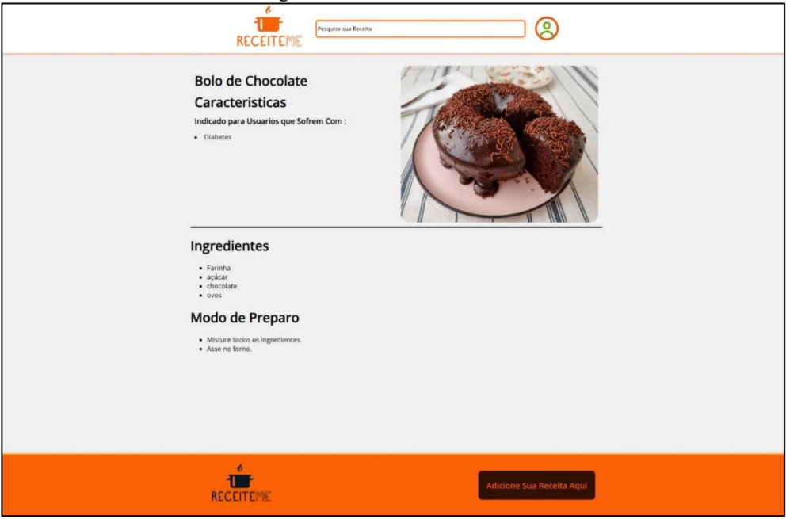
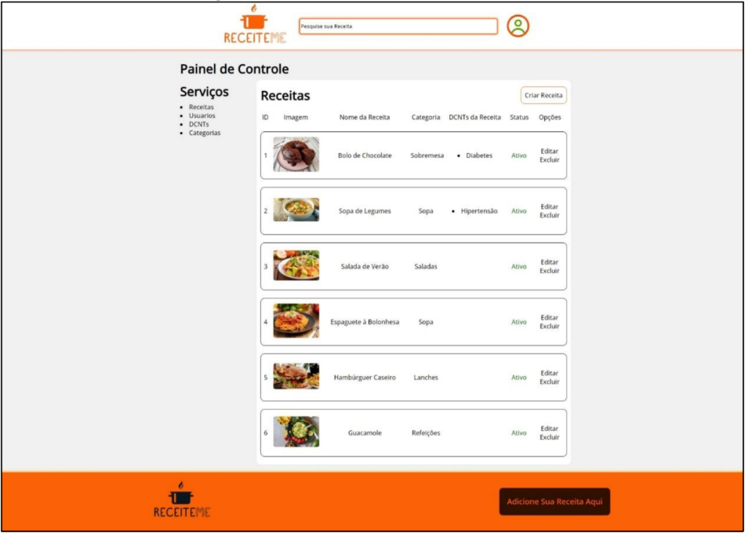

# 🍲 ReceiteMe

**Resumo**: Projeto desenvolvido como Trabalho de Conclusão de Curso (TCC) no curso técnico em Informática. O site tem como objetivo compartilhar receitas personalizadas, com filtros específicos para atender pessoas com Doenças Crônicas Não Transmissíveis (DCNTs), facilitando a busca por opções alimentares saudáveis
e adequadas a diferentes necessidades nutricionais.

## ✅ Funcionalidades

- Cadastro e login de usuários
- Upload de receitas com imagem, ingredientes e modo de preparo
- Filtros por condição de saúde e tipo de receita
- Sistema de perfil do usuário (visualização, edição)
- Interface responsiva para dispositivos móveis

### 🧪 Tecnologias utilizadas

- **PHP** – Backend e lógica do servidor
- **HTML/CSS** – Estrutura e estilo das páginas
- **JavaScript** – Funcionalidades interativas
- **MySQL** – Banco de dados para armazenar usuários, receitas, comentários, etc.
- **Bootstrap** – Para responsividade do site (**em desenvolvimento**)

### Pré-requisitos

- Servidor local com PHP (ex: XAMPP, WAMP, Laragon) utilizado Laragon para o desenvolvimento do projeto
- MySQL para banco de dados

### Passos

    1. Clone o repositório: "git clone https://github.com/Ramos902/ReceiteMe-Website.git" para sua area de trabalho local
    2. Copie a pasta do projeto para o diretório onde o servidor web está configurado:
    - XAMPP → C:\xampp\htdocs\
    - WAMP → C:\wamp64\www\
    - Laragon → C:\laragon\www\
    3. Importe o banco de dados (script localizado em assets/database.sql).
    4. Acesse o sistema pelo navegador: http://localhost:****/ReceiteMe-Website/index.php

## 📸 Screenshots

